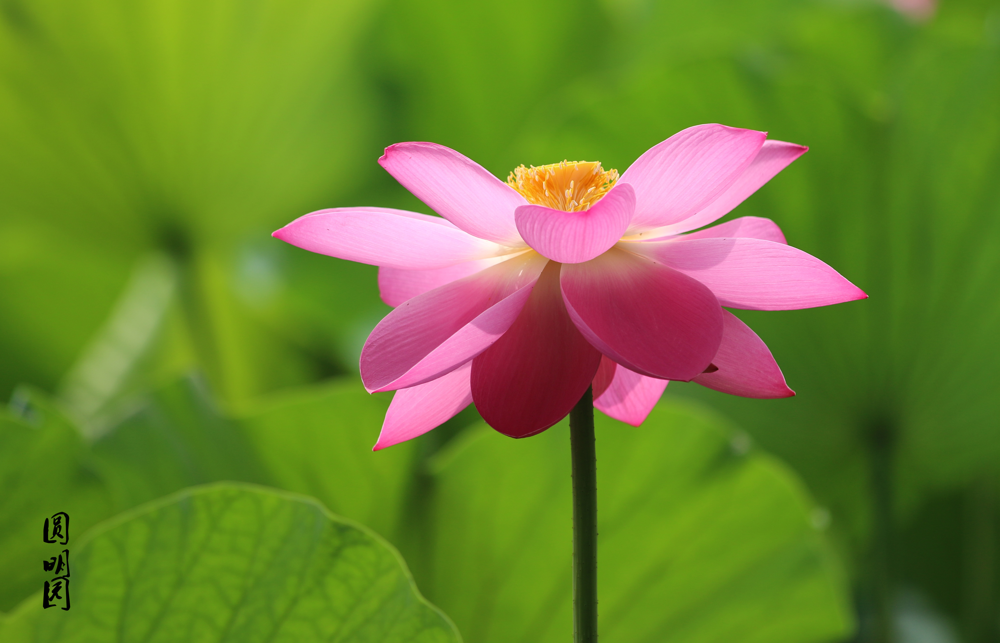
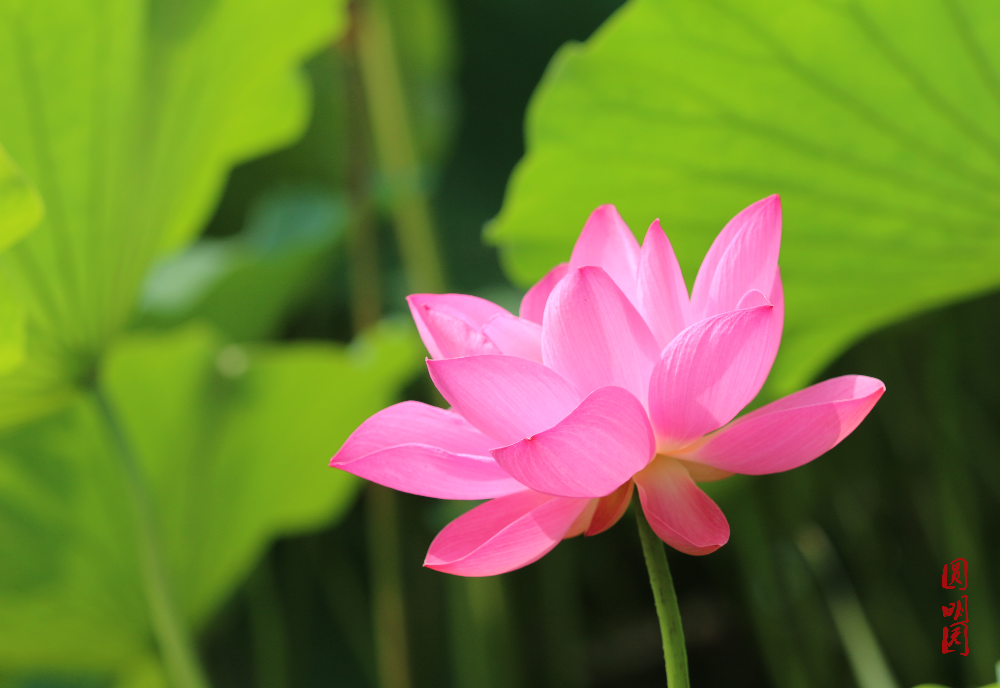
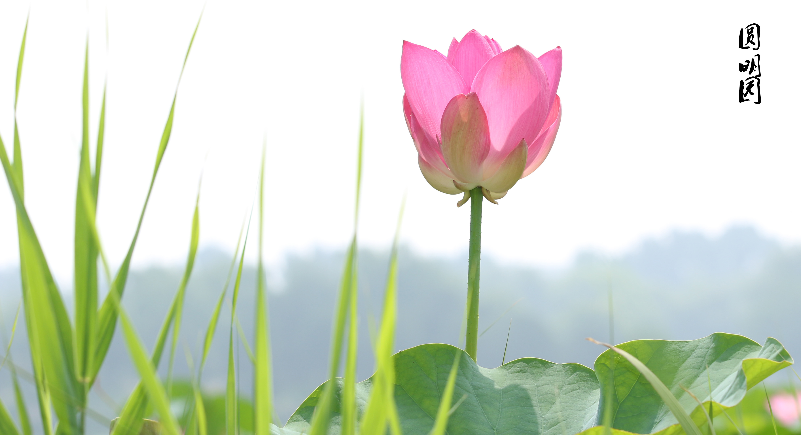
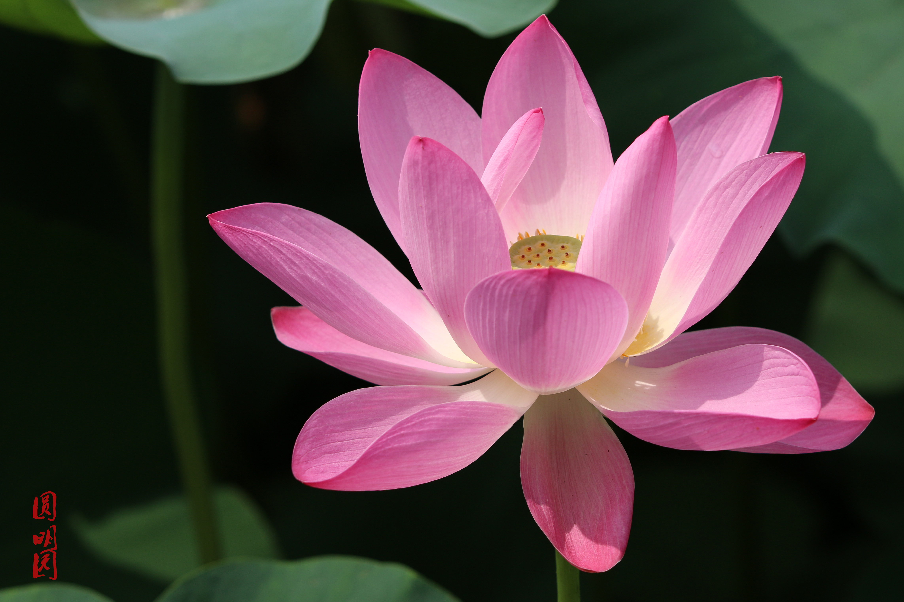
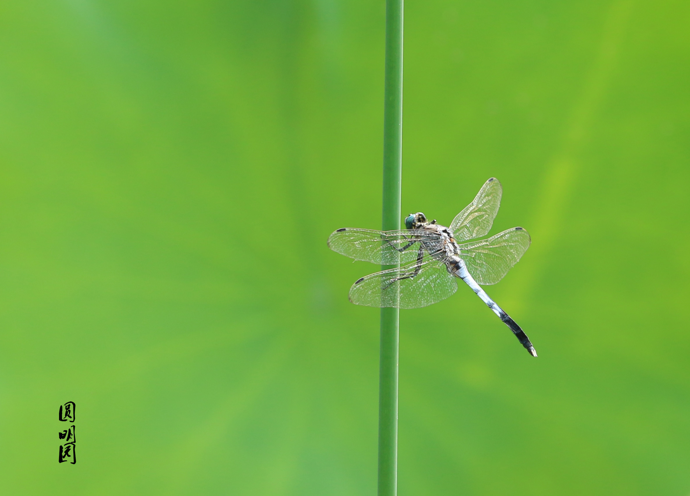

# 说在前面的话

圆明园每年夏季荷花盛开时都会有荷花节。而我也已经2015、2016两年都去参观了，当然今年也不会例外。每年参观人很多，如果天气比较热，最好早点去，如果去的太晚可能拍不到状态好的荷花。盛开又饱满的荷花一般都距离岸边比较远，最好用长焦拍摄。

# 直接上图

这个小孩和猫德照片说下：当时是已经拍完荷花在出来的路上，到大门口了，看到路边土坡上有一只猫咪，我个人比较喜欢猫狗，就上前逗了几下，这时一个小孩也上来，好像他也很喜欢的样子，摸着猫咪竟没注意到他左手的雪糕其实已经化了。孩子妈在旁边站着看着。小孩摸着猫咪，猫咪竟也不怕眼生，自顾的舔舐腿毛~~画面好不温馨，赶紧后退几步(镜头最近对焦距离1.2米)拍下这一幕。

再说下这个蜻蜓的图片：这个蜻蜓是在圆明园的黑天鹅区？名字好像忘了，但是那个区确实有个很大的石雕还是金属的天鹅塑像。在那部分水域也有些荷花。拿镜头扫射时发现的蜻蜓正落在荷叶杆上休憩。其实那片区域是有围栏的，不能靠近。幸亏长焦镜头直接拉到最远才看得清。换个角度把荷叶作为背景。咔嚓按下快门~~

