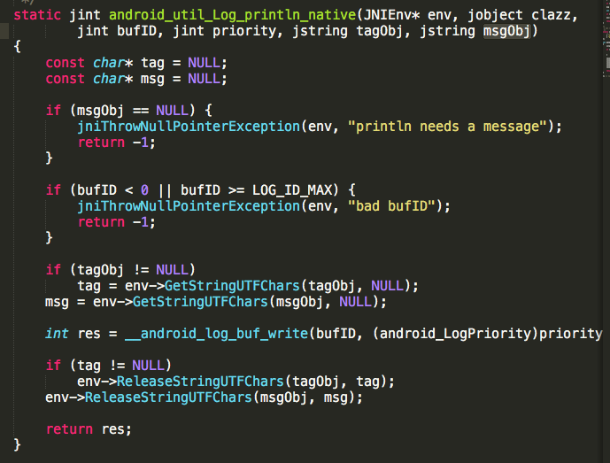
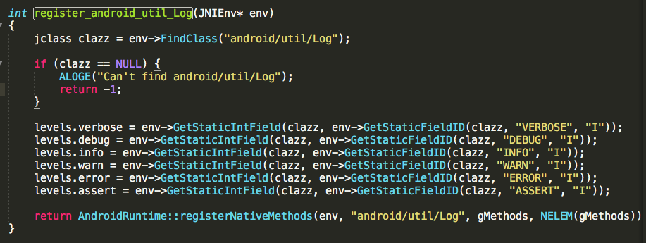
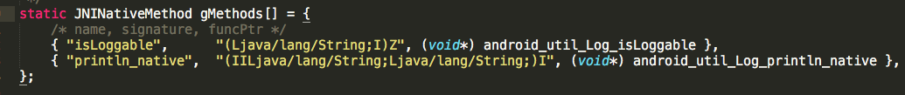
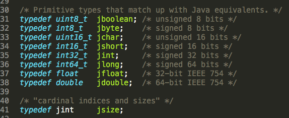

# 说在前面的话

>本来是没有打算写JNI的，因为本来是在看Binder机制原理的，但是看着看着就跑偏看到了JNI。。。

# 通过本章可以了解到这些：


- jni介绍

- 为什么要学习jni

- jni使用流程是怎样的

- 如何Java调用C

- 如何C调用Java

- 了解jni源码和机制

  <!-- more -->

# 什么是jni、ndk


jni(java native interface)，Java本地接口。在Java中接口就是一套协议标准，同样这里也是如此，jni是一套让Java和C互通有无的一套标准。看到这脑子里应该有个大概情况：


ndk,它只是一套开发工具集，如果再给它加个形容词，那就是本地开发工具集，即Native Development Kit。
>注意区别ndk和jni，一个是一套软件，一个是套标准。


# 为什么使用jni


- 1、效率问题

  C和C++效率比Java要高一些，虽然这种差距随着Java性能优化有越来越小的趋势，但是总归还是存在的。

- 2、安全问题

  虽然没有绝对的安全，但是相对来说C语言的反汇编比Java更不容易看懂

- 3、代码复用

  C语言年代久远，有很多现成的库，如果Java需要使用同样的功能，不需要自己从新实现，jni直接调用库即可。

# jni步骤流程


就像使用Java类要先加载类文件一样，要使用jni，首先要加载类库，然后通过Java层方法调用JNI层方法。调用流程如下：


上面是调用流程，调用的前提是先完成开发，也就是说开发流程是要先完成Java层方法和Native层方法。

基础介绍的差不多了，下面开始进入实际开发部分：


#  Java调用C

##  看看一般开发时Java如何调用C

Java层和JNI层之间源码是有对应规律的。

JNI实现文件命名为：Java全类名(下划线作分隔符)

JNI实现方法命名为：Java_为前缀+全类名(下划线作分隔符)+方法名

例如，现在Java定义native方法如下：

```
public class TestNative {
    // Used to load the 'native-lib' library on application startup.
    public native int add(int a,int b);
    public native String stringFromJNI();
}
```

那么按照规范，jni实现方法名为：

```
Java_com_example_jenson_myapplication_TestNative_add(JNIEnv *env, jobject instance, jint a,
                                                     jint b) {
    return a+b;
}
```

Java声明方法和jni实现方法都已经实现了，接下来就是调用实现库(.so文件，关于so的编译不在讲):

```
 static {
        System.loadLibrary("native-lib");
    }
```

上面是最普通也是最简单的jni开发流程三步走，但是其中有很多问题没有弄明白，比如JNIENV是什么，Java中参数int为什么变为jint了等等。

学习最好的方法就是看代码，那么我们就看看系统jni使用示例：Log打印系统。

## 看看Log打印系统Java如何调用C

首先我们看下Log.java的源码才好下手。

### 简单介绍Log.java源码

看看Log.i()方法实现：

    public static int i(String tag, String msg, Throwable tr) {
        return println_native(LOG_ID_MAIN, INFO, tag, msg + '\n' + getStackTraceString(tr));
    }
    
    public static int w(String tag, String msg) {
        return println_native(LOG_ID_MAIN, WARN, tag, msg);
    }
可以看出真正的打印是在 println_native 方法中，而这个方法是一个本地方法：

```
public static native int println_native(int bufID,int priority, String tag, String msg);
public static native boolean isLoggable(String tag, int level);
```


> 原来JNI中Java层的实现这么简单，只需要声明一个native修饰的方法，传入必须的参数就行了。

下面研究中心要转移到jni层实现了，源码那么多如何找到jni实现呢？

### JNI层源码探究

- 查找JNI层实现

  按照上面说的规范，直接查找Java类Log的全类名。

  例如 Log类全类名为android.util.Log，其对应的Native文件名称应该为android_util_Log。我们试下：

  

  果真找到了，下面开始探究源码：

- JNI源码开扒

  我们首先找到Java层println_native方法JNI层的实现，按照上面的命名规范，没有找到 Java_android_util_Log_println_native ，但是却找到了这个方法：android_util_Log_println_native ，看来Android系统级的JNI没有遵循规范啊。不过没关系，*只要记住JNI有两种方式：一种是遵守JNI命名规范的日常使用方法，另一种是是这种系统级JNI没有Java_前缀就行了* 。不影响我们看代码：

  

  可以看出该方法代码比较少，因为我们是研究JNI，而不是研究Log如何打印，所以方法中对于其他方法调用不再深入研究，但是现在Java声明方法和JNI实现方法都找到了，但是系统式如何把这两个给关联起来的呢？我们继续往下看：

  ​

- Java和JNI双方的方法如何对上眼的

  在该文件中有这样一个方法 register_android_util_Log，我们看下实现：

  

  这个方法前面大部分代码给我的第一感觉就是：这么TM和Java的反射好像啊！难道是C++版反射？反正意思就是通过Java的Log类拿到该类的几个变量(C语言中习惯称为域)

  看最后一行调用了AndroidRunTime的方法，顾名思义是注册本地方法，其中参数 gMethods  值得一看：

  

  这是一个静态结构体数组，这个比较有意思，看注释可以看出大括弧的三个元素分别是名称、签名和函数指针。而名称恰恰是Java里面声明的本地方法，签名是本地方法的签名，函数指针指向的是Native实现方法。一个数组就把Java方法和Native方法给关联起来了。因为Java支持方法重载，为了确保调用的唯一性，于是就有了方法签名，下面说说方法签名机制：

  首先看下签名规则：

  | Java类型  | 类型签名    |
  | ------- | ------- |
  | boolean | Z       |
  | byte    | B       |
  | char    | C       |
  | long    | J       |
  | float   | F       |
  | double  | D       |
  | short   | S       |
  | int     | I       |
  | 其他类     | L全类名;   |
  | 数组      | [元素类型签名 |

  > 注意：方法签名格式分为两部分：参数类型签名+返回值类型签名，类型签名之间没有空格，其中参数类型签名使用()括起来，有多少参数就有多少参数类型签名，格式为： *(参数1类型签名参数n类型签名)返回值类型签名* ,注意全类名用"/"分隔。

  拿 boolean isLoggable(String tag, int level) 举例来说其方法签名为(Ljava/lang/String;I)Z 。

  说完了方法签名规则，我们继续，在android_util_Log文件中有jni方法，所以有了 register_android_util_Log 来注册该文件的jni方法，那么在其他有jni方法的文件中是不是也有类似的register_xxx方法呢？怀着好奇心，打开Parcel看看：

  ```
  int register_android_os_Parcel(JNIEnv* env)
  {
      jclass clazz;

      clazz = env->FindClass(kParcelPathName);
      LOG_FATAL_IF(clazz == NULL, "Unable to find class android.os.Parcel");

      gParcelOffsets.clazz = (jclass) env->NewGlobalRef(clazz);
      gParcelOffsets.mNativePtr = env->GetFieldID(clazz, "mNativePtr", "J");
      gParcelOffsets.obtain = env->GetStaticMethodID(clazz, "obtain",
                                                     "()Landroid/os/Parcel;");
      gParcelOffsets.recycle = env->GetMethodID(clazz, "recycle", "()V");

      return AndroidRuntime::registerNativeMethods(
          env, kParcelPathName,
          gParcelMethods, NELEM(gParcelMethods));
  }
  ```

  看到register_android_os_Parcel 方法证实了我的猜测，所以根据归纳法暂且可以认为系统的涉及jni方法的文件中都会有对应的注册方法而且最终都调用了AndroidRunTime::registerNativeMethods()。

  其实registerNativeMethods方法的第二个参数是类文件路径：

  ```
  AndroidRuntime::registerNativeMethods(env, "android/util/Log", gMethods, NELEM(gMethods));
  ```

  而mMethods数组中又对应了JNI实现方法和Java方法，通过registerNativeMethods方法调用jniRegisterNativeMethods()然后调用RegisterNatives方法最终告诉了JVM Java类和JNI实现方法的映射关系，这样就完了Java调用C。

  ​

- Java类型和JNI类型如何对应的

  首先看下基本类型的对应关系：

  | Java类型  | JNI类型    | 字长   |
  | ------- | -------- | ---- |
  | boolean | jboolean | 8位   |
  | byte    | jbyte    | 8位   |
  | char    | jchar    | 16位  |
  | short   | jshort   | 16位  |
  | int     | jint     | 32位  |
  | long    | jlong    | 64位  |
  | float   | jfloat   | 32位  |
  | double  | jdouble  | 64位  |
  | void    | void     |      |

  很好奇jboolean这些类型是怎么来的，既然是jni类型就先去jni.h头文件下看看有没有定义：

  

  竟然找到了，本来以为jxx是jni新开发的类型，原来就是对C类型起了一个别名。简单理解就是把Java基本类型的值给到了占用同样字节大小的C类型上。

  下面再看看引用类型对应关系：

  | Java类型                                   | JNI类型                                    |
  | ---------------------------------------- | ---------------------------------------- |
  | java.lang.Class                          | class                                    |
  | java.lang.String                         | string                                   |
  | java.lang.Throwable                      | throwable                                |
  | Object[]、boolean[]、byte[]、char[]、short[]、int[]、long[]、float[]、double[] | jobjectArray、jbooleanArray、jbyteArray、jcharArray、jshortArray、jintArray、jlongArray、jfloatArray、jdoubleArray |
  | java.lang.Object                         | jobject                                  |

  ​

#  C调用Java

上面介绍了Java如何调用C，本节讲下C如何调用Java：

C调用Java按流程走也很简单，通过全类名找到类，找到类构造方法，根据构造方法构建对象，根据对象调用变量和方法。OK，我们通过一个示例来讲解下：

示例流程是这样子，我们通过Java方法stringFromJNI调用JNI实现方法，但是在实现方法中并没有直接返回一个字符串，而是该方法中调用了一个Java方法，其实现如下：

```
    public String callByNative( ){
        return "callByNative";
    }
```

返回的字符串直接显示在TextView中：

```
    sample_text = (TextView) findViewById(R.id.sample_text);
    TestNative testNative = new TestNative();
    sample_text.setText(testNative.stringFromJNI());
```

接下来我们需要自己在stringFromJNI的实现方法中调用Java层的callByNative：

首先通过全类名找到类，通过FindClass方法,参数为全类名：

```
    jclass clazz = env->FindClass("com/example/jenson/myapplication/TestNative");
```

然后通过构造方法构建对象，要调用构造方法先找到构造方法的ID：

```
jmethodID mid = env->GetMethodID(clazz,"<init>","()V");
jobject  obj= env->NewObject(clazz,mid);
```

要注意的是：构造方法比较特殊，所以第二个参数的方法名要传”<init>“，第三个参数为方法签名，至于签名规则上面有介绍，根据参数自己填写签名。

创建对象时使用NewObject，需要传入创建对象使用的类及构造方法对应的id。

对象上面已经创建完成，接下来可以调用实例方法callByNative了：

```
 mid = env->GetMethodID(clazz,"callByNative","()Ljava/lang/String;");
 jstring js = (jstring) env->CallObjectMethod(obj, mid);
```

注意调用一个方法前要先获取方法ID，然后通过Call<Type>Method方法传入对象和方法ID，达到实例方法调用。

因为callByNative方法返回的是String，所以按照上面说的应该调用CallStringMethod方法，但是jni没有这个方法，所以直接使用了CallObjectMethod，然后强制转换来得到String，比较Object是一切类基类。

最终stringFromJNI实现代码如下：

```
Java_com_example_jenson_myapplication_TestNative_stringFromJNI(JNIEnv *env, jobject instance) {

    // 这里通过C调用callByNative方法
    jclass clazz = env->FindClass("com/example/jenson/myapplication/TestNative");
    jmethodID mid = env->GetMethodID(clazz,"<init>","()V");
    jobject  obj= env->NewObject(clazz,mid);
    mid = env->GetMethodID(clazz,"callByNative","()Ljava/lang/String;");
    jstring js = (jstring) env->CallObjectMethod(obj, mid);
    if (js ==NULL) {
        js = (jstring) "hello";
    }
    return js;
}
```


看下执行结果，达到了我们的要求：


jnienv提供了很多参数实现C调用Java，诸如：GetMethodID、FindClass、GetFieldID，还有静态方法和域：GetStaticMethodID、GetStaticFieldID等，感兴趣的可以去jni.h去研究下。


# JNIENV是什么鬼


# JNI异常处理

