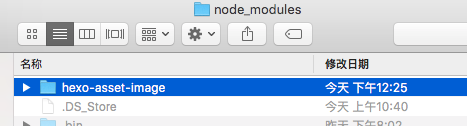
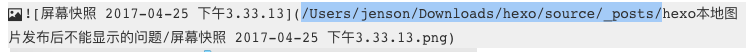
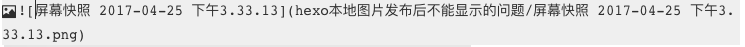

# 说在前面的话

工作好几年，终于花了点时间搞了个自己的网站，基于Hexo+Github+个性域名，玩的不亦乐乎。但是这两天发现个问题比较蛋疼。就是Hexo基于MarkDown文本的。如果在写文章时想加入图片，如果你的图片来自其他网站，那么当你发布后是没有问题的，因为其url就是那个图片网址。但是如果你的图片来自你的本地、这样在你预览时是没有问题的，但是细心看下就会发现，markdown中的本地图片是url地址是本地地址。这样如果你发布文章后，别人肯定是看不到你的图片的。这样体验很不好。最开始的想法就是先在简书发布，发布后图片url都是来自简书网站url，而非本地，这样是没问题的，但是这样自己的网站显示个图片还要依赖简书平台，可能代码写多了，总感觉耦合性太强啊~~所以就在找怎么把两个平台独立开来，而自己网站又能发布图片的方法。

经过查找发现hexo-asset-image插件可以比较好的支持本地图片发布。

# 开启资源文件支持

在hexo目录下的_config.yml配置文件中找到这个配置：

```
post_asset_folder: false
```

把这里的false改为true。开启hexo的媒体文件支持。

# 安装插件

在命令行中，跳转到hexo目录下，执行：

```
npm install https://github.com/CodeFalling/hexo-asset-image --save
```

会自动安装插件，插件会安装到node_moudules目录下，

同时还会自动在hexo目录下package.json中添加一行：

```
"hexo-asset-image": "git+https://github.com/CodeFalling/hexo-asset-image.git",
```

> 说这些就是想告诉你，不用的时候如何卸载：删掉那个文件夹和那一行就行了。

以上执行完毕后，在命令行执行：hexo new "文件"时，会在_post文件夹下同时生成md文件和同名文件夹，这个同名文件夹就是用来放图片的，把你在该文章中需要显示的图片放进去，然后在markdown中选择该目录下的图片使用，这样当md编译生成html文件时，会把图片拷贝到html文件同目录中。最后执行hexo d -g 部署到服务器时，图片也就被部署到服务器中了。


注意：如果直接把图片拖动到markdown编辑器中，其路径可能为绝对路径，需要改下：



修改为相对路径：




# 结尾

上面说了hexo new "名称" ，这样每次同时生成文件和文件夹，当然也可以不使用命令行，直接在_post目录下手动创建md文件和文件夹亦可，手动创建的好处时如果你的文章不需要图片，那么你可以不创建对应的文件夹。