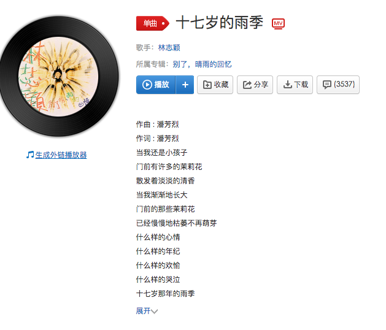

# 0x00 拿到网易云音乐外链

因为版权问题有一些音乐不能设置外链，所以要先找到合适的音乐，然后点击生成外链播放器，音乐界面如下：



如果没有权限会弹出提示，如果有权限就会跳转对应页面[外链页面](http://music.163.com/#/outchain/2/114442/)。


# 0x01 给文章添加播放器

给文章添加外链很简单，直接复制上面的外链到x.md文件中即可。运行后就会在对应的发布后的文章中显示出播放器。


# 0x02 给主题yilia添加播放器

- 找到对应布局ejs文件添加外链

  找到`theme/yilia/layout/_partial/left-col.ejs`文件，在末尾header标签前添加外链：

  ```html
  		<!-- 添加网易云音乐插件-->
  		<nav class="header_music">
  			<iframe frameborder="no" border="0" 	marginwidth="0" marginheight="0" width=250 height=86 src="//music.163.com/outchain/player?type=2&id=114442&auto=0&height=66"></iframe>
  		</nav>
  	</header>
  ```

  `auto=0`为关闭自动播放，`auto=1`为开启自动播放。

- 找到对应css文件添加格式

  找到`theme/yilia/source/main.266c1c.css`文件。如果你的目录下没有这个文件，那就在同目录下找到类似`main.xxx.css`文件。不同版本名称可能有不同，格式都一样。

  在最后添加代码：

  ```css
  .header_music {
    margin-top: 140px;
  }

  ```

  最后如果当时没有刷新过来，

  就执行`hexo clean`清除缓存，

  然后在`hexo d -g`。