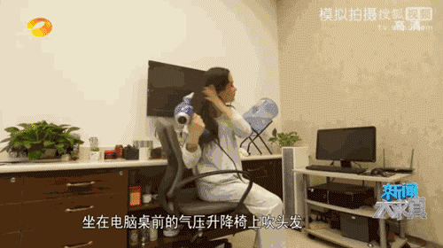
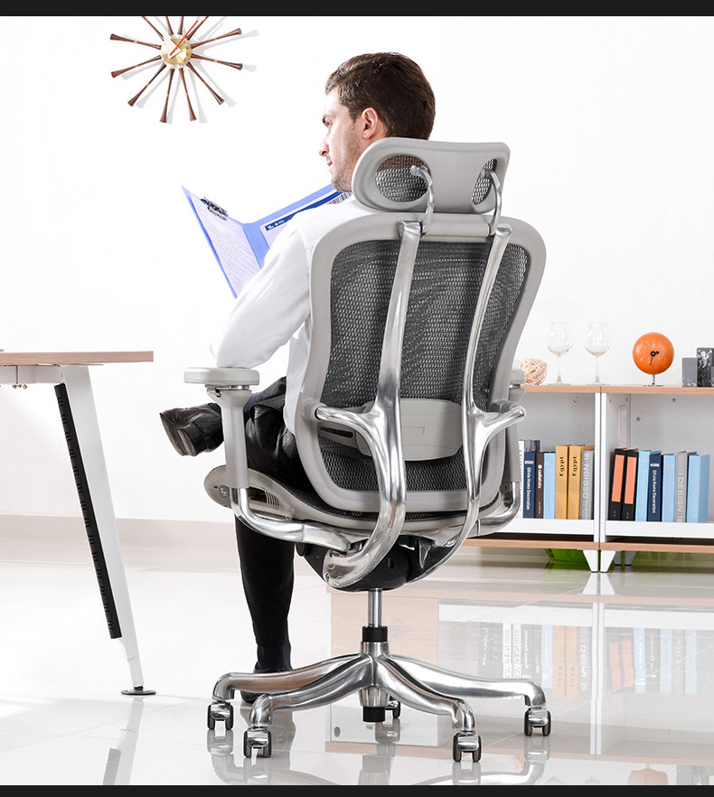

# 说在前面的话

工欲善其事，必先利其器。可能也有强迫症的原因，上班时总是会想尽办法提高工作效率，同时给自己创造一个愉悦的工作状态。对于能提高效率的硬件因素自然不能放过。什么罗技鼠标、机械键盘宿舍公司各一套。为了方便显示器调整，又买了乐哥支架，这样能随时调整角度，避免一个姿势容易疲劳。但是最近又出现了一个问题：一个姿势坐半个小时就浑身不自在，脖子僵硬大脑供血不足，严重时候还有恶心呕吐现象。其实不用说也猜到了—颈椎病，如果置之不理以后腰椎可能也会出现病症。毕竟这是很多IT从业人员的通病，如何缓解病况才不致于影响工作效率呢？个人感觉一把人体工学电脑椅是必须的。

# 什么是人体工学电脑椅

看下[百度百科](http://baike.baidu.com/link?url=DtpSA5XKbKnq0i8zuufuO3XadcstS54-xa_Yy1tgbhl2P962gqvxcBdlTMD9X38dAhw9THJrNJ4LvH3v_LrY34E1ENL3-2sLwtmJapNyawT3y9q8Q6rki5jdqYXnD9XahJADbgkPqYscZxNB0ImSqnqI62tEybnCUKPugI6sPRi) 对人体工学电脑椅的定义：人体工学电脑椅也称人体工学椅、人体工学办公椅，它是以“人体工程学”理论为基础，通过对人们在使用电脑椅的过程中的各个数据进行统计汇总，并根据最终统计的数据而设计研发的电脑椅。

我们日常坐的椅子都是批量生产，都有固定的规格，并不能适应所有人，所以人体工学椅子和普通椅子一个明显区别就是：可调节！可调节的手托、可调节的坐垫高度、可调节的坐垫前后深度、可调节的枕托、可调节的背靠、可调节的腰托等。

# 一把质量差的电脑椅

质量差的电脑椅能有咋的，顶多坏了摔一跤？还是看图最直观：

上图的爆炸是气压棒爆炸引起的。

电脑椅升降功能大都是靠气压棒来实现的。那么什么是气压棒呢？

看下[百度百科](http://baike.baidu.com/item/%E6%B0%94%E5%8E%8B%E6%A3%92) 对气压棒的定义，其实说白了气压棒就是靠对棒内气体压缩和释放来达到升降电脑椅的。正品气压棒里面是高纯度氮气填充，并不会爆炸，而一些无良厂商为了节省成本，往往会以价格更为低廉的氧气作为填充物。氧气易燃，遇明火极易产生爆炸，酿成不可挽回的事故。

# 一个气压棒引起的事故

- 1.2007年4月20日晚，浙江省舟山市定海区，一位娄女士坐的椅子发生爆炸，座椅被炸穿，娄女士穿的裤子被炸了个大洞，硬塑料、木屑、海绵、布料、密封圈等大量碎片崩进娄女士体内达十厘米。

- 2.2007年11月26日晚，烟台开发区68岁的吴老先生所坐的气压升降椅发生爆炸，臀部、腿部、直肠肛管和小肠受伤严重。

- 3.2008年3月26日晚，江西赣州市，一位林先生家中的电脑椅突然发生爆炸，林先生背上、手上等处受伤，一根大约15厘米长的小铁棍炸飞到天花板上。

- 4.2009年1月14日，山东胶州14岁少年小刚(化名)独自在家上网，在调节气压椅升降时，突然发生爆炸，顶杆从臀部顶进小刚体内，伤及多条血管，后因失血过多，抢救无效死亡。

- 5.2010.5.12晚上9点半左右，厦门湖里殿前一户出租屋传出巨响。一名女子被突然发生爆裂的升降椅击伤。升降旋转椅突然爆炸，产生的冲击力将椅子里的螺丝小垫片等零件像子弹一样从臀部射入人体内。升降椅的气压杆插入伤者的肛门。女子当场晕倒在地。所幸经过5个多小时的手术，射入体内的椅子零件全被取出，刘小姐无生命危险。

- 6.2010年5月，福建一女子因气压升降椅爆炸伤势严重当场昏迷，臀部被炸伤，直肠被撕裂了一个口子，阴道也穿了一个孔。后检查椅子的购物单据，没有任何厂名、厂址、电话之类信息。

- 7.24岁的小林坐在升降旋转椅上吹头发，椅子爆炸，螺丝钉从她肛门边上穿进去，从子宫直肠陷凹处穿出。经过手术，医生从她的体内和臀部取出大量的螺丝钉和塑料碎片。医生说，还算幸运，穿过体内的螺丝钉没有伤及重要的脏器，手术后小林已脱离生命危险。

  > 请务必一定要提醒你的家人和朋友注意：
  >
  > 1、务必购买正规厂家生产的升降椅，切勿贪图便宜，购买劣质货。
  >
  > 2、椅子在使用时，不要反复升降，不要滑来滑去，更不要猛地一下子坐上去。这易造成气压杆受力不均，长时间产生不均衡磨损，易爆炸。据模拟测算，爆炸会产生24个左右大气压，其威力至少能击穿6块密度板，顷刻能洞穿血肉之躯!
  >
  > 3、如果不是专业人士，不要拆开气缸，也不要让椅子靠近太热的东西，比如烤火炉或烤箱。
  >
  > 4、使用一段时间后，应该及时让专业人员检查，一旦发现裂痕、松动迹象，应及时维修更换。

# 如何挑选人体工学电脑椅

## 价格

从价格上来说，和其他商品一样，往往都是一分钱一分货，一块钱二分货。

国际品牌有欧美的Herman Miller、日本的岗村，这些高端系列普遍价格过万或者近万元，当然也有三五千的，但是可选性比较少。

国内品牌有ergonor、ergomax以及黑白调、西昊等。国产价位3000以上就算是高端了，譬如金豪+e、l和ergomax旗舰版。

个人感觉如果要买人体工学电脑椅，还是要舍得投资的，毕竟这投资的是自己的健康。建议起步买2k-3k的。毕竟这个价位在国内属于高端，国外品牌也能买到。这个价位的各方面功能齐全，可以都体验下，为以后的挑选打下基础。

## 网布

坐垫和椅背的材质有皮质、网布和海绵坐垫，我更喜欢全网布的，夏天透气性更好，但是也有个问题：如果网布质量不好，可能坐一段时间后网布就失去弹性，变得松垮。

高端电脑椅网布大都进口，进口网布主要是美国matrex，韩国wintex次之，其他基本就是国产的。

**进口网和国产网的差别：**

价格：进口的美国Matrex网最贵，韩国Wintex网次之，国产网价格最便宜网，而且进口网涉及空运报关原因，货期长。

耐用性：在厂家的垂直堕下机械测试中，进口Matrex网和Wintex网可以通过10万次强力冲击，国产网在按不同牌子在6-8万次之间会出现爆裂!

材质：美国Matrex网和Wintex网材质柔软，弹力强，国产网比较硬，弹力及恢复力差。

Matrex表面反光呈黏手手感，Wintex网表面反光呈光滑手感，国产网按不同牌子部分表面光滑，部分表面粗糙。

据Matrex网和Wintex网国内代理商的说法，国内厂商用进口网布的并不多，内销产品基本都不会使用进口网，进口网一般都是外国客户指定要求才用的，原因在于进口网不仅更贵，而且在订购数量方面有要求，由于涉及空运报关因素，邮寄周期也比较长，这样就限制了小厂家的采购，掌柜曾经在网上看过一些网店几百产品也宣称使用Matrex网，那是不可能的，进口网，基本上只出现在2K以上的产品。

**Matrex和wintex网布都是有吊牌的，如果商家真的采用这两种品牌，一定会拿出来当噱头显摆一番的，而不是轻描淡写的一句采用进口网布草草了事。网上那些说进口网布，但又不敢指明具体品牌的，就当时国产就行了或者不要买，毕竟涉嫌欺诈。**

## 气压棒

气压棒是有分级的，目前是共有四级：普遍使用的时三级，少数所谓高端使用四级。

常用气压棒品牌：国内知名的有：安徽莱特，安德福，常州巨威，安吉斯诺尔，等还有一些进口的：韩国KGS，韩国三弘，德国SUS棒，台湾MID棒等等。

**买回来后看气压棒有没有钢印，查看钢印信息是否和商家描述一致，如果有问题即时质疑。**

## 底座

一般来说都有底座防爆措施，但是价格越高底座用料越实，甚至是全铝合金底盘。我的2k 的gavee整个椅子70多斤重，厚重的材质更容易给人以安全感。

**我对铝合金椅身有特殊好感，或许害怕塑料椅身不结实，也或许铝合金抛光后看起来更高端也更敦实。**

这是我的电脑椅样式：

