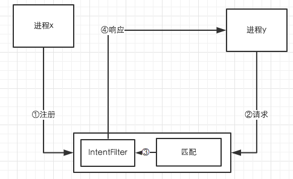

# 0x00 前言

Intent，译为“意图”。从汉语角度理解，意图是什么意思？意图谋反，就是想要谋反。所以意图可以通俗理解为想要做什么。当然这里的“想要做什么”是告诉Android系统的而不是别人。

虽然想要做什么就告诉Android系统，但是并不是为所欲为的。通过Intent只能请求三大组件：Activity，Service，Broadcast。

# 0x01 抽象理解

因为涉及三个组件，这里不会单独讲每个组件和Intent。startActivity不要叫启动Activity，startService也不要叫启动服务，我们把他们抽象为一个请求。通过Intent向Android发出请求，Android去哪给你匹配呢？你不注册系统当然没地方找，所以我们要在AndroidManifest.xml中进行注册(广播可以动态注册)。注册的作用不光告诉系统可以从这找我，还告诉系统本组件只接收满足要求的请求。说到要求这就要提到IntentFilter了，每个IntentFilter代表一种要求，一个组件可以有多种要求即多个IntentFilter，但只要满足一种就能请求成功。系统所要做的就是把接收到得请求Intent和组件的要求IntentFilter进行匹配，如果匹配上了则牵手成功~

这个流程抽象为：



# 0x02 分类

通过Intent告诉Android系统“我想要做什么”，可以有两种方式阐述，一种是直白的表述“我想要启动某个页面”，我们称之为显性，另一种是告诉系统“我想要一个满足我某些要求的页面”,至于是哪个或哪几个页面由系统决定，如果是多个可以返回列表给我，这种称之为隐性。

>Intent从请求性质上分为显性和隐性两种。


由于显性Intent指定了具体的请求，如下：

```java
intent.setClass(Context packageContext, Class<?> cls)
```

所以匹配并不会发生在显性Intent,显性组件注册时一般这样的：

```xml
<activity android:name=".ThirdActivity" />
```

没有多余的要求。

在抽象理解中，IntentFilter匹配只是为隐性准备的。

下面要了解具体匹配规则如何：

# 0x03 匹配规则

要了解匹配规则是怎样的，首先要知道是从哪几方面入手匹配的，由于Android系统也是根据组件注册的要求进行匹配，所以看看注册时的IntentFilter有哪些属性就知道要匹配哪些方面了：

```xml
 <intent-filter>
     <action android:name="android.intent.action.CALL" />
     <category android:name="android.intent.category.DEFAULT" />
     <data android:mimeType="image/*"/>
     <data android:scheme="http"/>
 </intent-filter>
```

显然系统匹配也就是匹配category、action和data。

下面分别来看看这三种是分别如何匹配的：

**注意：下面将原理、源码、实例三管齐下** 

- category如何匹配

  > 匹配原理：
  >
  > ①在请求的Intent中需要在IntentFilter找到匹配项才算匹配成功。
  >
  > ②如果Intent没有添加任何category，那么系统会自动给你添加android.intent.category.DEFAULT，所以如果你的三大组件是为隐性启动准备的，那么你就要在注册时手动添加<category android:name="android.intent.category.DEFAULT" />。
  >
  > ③当然如果添加了其他值得category也可以不用添加default了。

  ​


- action如何匹配

  > 匹配原理：
  >
  > ①IntentFilter如果没有声明action，则所有Intent都不能匹配成功。
  >
  > ②若IntentFilter声明了action，而Intent没有不带任何action，则匹配通过。
  >
  > ③若IntentFilter声明了action，Intent也声明了action，那么Intent中action必须是IntentFilter中action的子集才能匹配成功。


- data如何匹配

  data分为两部分，MIME type和URI。

  - MIME type就是表明数据格式类型，方便系统正确解析处理

    MIME type又分为两部分：主类型type和子类型subtype，以"/"分割。比如：

    video/mp4，image/jpeg。

  - URI 唯一资源标识符

    URI分为scheme、Authory和path三部分。

    scheme表示采用协议，既可以是http网络协议也可以是本地content和file协议。

    Authority由host和port组成。

    path表示文件在host中具体位置。

  了解了data组成，下面说说data匹配原理

  > 匹配原理：
  >
  > ①data只匹配IntentFilter中所拥有部分。
  >
  > ②如果Intent中既没有MIME，也没用URI，那么IntentFilter中也都不能有才能通过。
  >
  > ③若Intent没有指定类型，只指定了URI，那么IntentFilter必须没有指定类型。特殊情况下能根据URI推断出类型，这种情况按⑤情况算。
  >
  > ④若Intent只指定了类型，没有URI。那么IntentFilter也必须没有指定URI
  >
  > ⑤若Intent同时指定了类型和URI，那么必须都匹配上才能通过。