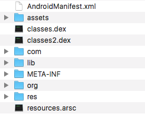
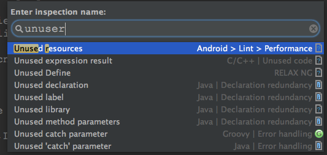
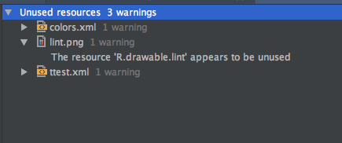

# 0x00 前言

可能会有人有疑问，安装包还需要优化吗？现在流量都用不完的！

这样来说吧，优化有多方面好处的：

①节省用户流量

②安装包越小，用户就越快下载完，缩短了联网时间，联网时间短耗电也就越少

③越快下载完，用户就越能提前使用APP，避免对用户耐心的过多消磨。

所以，安装包优化还是有必要的。

# 0x01 安装包构成

要想优化安装包，首先知道包由哪些部分组成的。这是电视猫app解压后目录：



目录中com和org两个文件夹是第三方包信息，不用管着两个。

- assets可以存放资源和配置等各种文件，但是这里的资源文件不会像res中那样生成ID，而是通过AssetManager获取
- dex是Java文件编程成class文件后又经过虚拟机优化压缩形成的
- lib中存放native类库，根据不同CPU架构有四种类型：armeabi，armeabi-v7a，x86，mips。
- META-INF保存了app签名信息
- res中存放了资源文件
- resources.arsc 记录资源文件和资源ID映射。可以根据ID查找资源
- AndroidManifest.xml是app配置文件注册四大组件，声明权限等。


知道了各个部分作用就大概知道了该从哪方面入手了：代码和资源，因为包中这两个部分占了很大一部分。

# 0x02 代码优化

代码优化其实包含了Java代码和Native代码，但是因为Native代码涉及了C和C++，这里不做阐述，但是说下lib库还是有必要的

## lib库

根据cpu架构lib中分为四种类型，但是目前大部分移动设备都是基于arm和arm-v7a的。x86和mips较少。而且据说x86兼容arm指令集，所以适配库优先考虑arm和arm-v7a两种即可。

## Java代码优化：使用ProGuard代码混淆

ProGuard具有压缩(移除无效类、方法、属性)、优化、混淆功能。

- 开启混淆

  ```groovy
      buildTypes {
          release {
              minifyEnabled true//开启混淆
              proguardFiles getDefaultProguardFile('proguard-android.txt'), 'proguard-rules.pro' //混淆文件
          }
      }
  ```

- 压缩

  压缩功能是默认开启的，如果对某个或某些文件不想压缩可以使用：

  `-dontshrink class * extends android.app.Activity`。

- 优化

  优化optimization默认开启，如果不开启可以使用：

  `-dontoptimize`。一些相对复杂的方法时，压缩后可能会抛出errors，这时可以不压缩。

- 混淆

  混淆也是默认开启,如果对某些文件不想混淆可以使用：

  `-dontobfuscate`。

- 保留

  如果想保留某些类、成员等不被混淆可以使用：

  `-kepp`。

  ​

  关于proguard更多使用方法可参考：

  [Android进阶之ProGuard代码混淆](http://hanhailong.com/2015/12/28/Android%E8%BF%9B%E9%98%B6%E4%B9%8BProGuard%E4%BB%A3%E7%A0%81%E6%B7%B7%E6%B7%86/)

  [Jean同学的Proguard私房物语](https://my.oschina.net/u/659658/blog/71976)

  ​

# 0x03 资源优化

这里的资源优化主要是Res资源。

## 删除无用资源

因为需求变更，版本更新等因素，很多研发只是一味的把新的资源文件让res下面扔，却没哟及时的把不用的文件给清理掉，长此以往导致res越来越臃肿。

res资源的定时清理是很有必要的，但是资源那么多如何快速清理呢？

Android提供了非常好用的工具Lint快速检测res中未使用的资源并给出提示。

运行Analyze—>Run Inspection By Name ，弹窗输入：



执行结果如下：



其中lint.png图片没有使用，可以删除。Lint不只检测图片，而是res中所有资源包括未使用的string。

## 资源图片最少化

这里最少化有2个参考原则：

①简单的图片shape画

②多状态的图片filter画

下面分别说说这两个原则都是什么意思

- 简单的图片shape画

  这里的简单是图形简单，颜色简单，比如矩形、圆角等纯色能用shape方便绘制出来的。

- 多状态的图片filter画

  这里的filter是colorFilter。

  比如一些按钮都有默认背景色和选中背景色。这时设计一般会提供两套图片，如果使用colorFilter，我们只要一套就可以了。

## 图片再压缩

在app打包时，aapt会对图片进行压缩处理，但是这种压缩比较有限。因此我们可以再拿到设计给的图片后，使用一些工具进行二次压缩，比如Zopfli，这时谷歌开源项目。再比如PNGoo。

# 0x04 其他优化

- 使用webp代替png

  webp从4.0开始支持，但是这时不支持透明度。较好地支持从4.2.2开始。

- 精简第三方库

  很多时候可能只需要第三方库的一部分功能，这时可以根据公司业务需求进行精简，这样会有个问题就是后期的库版本更新会是个问题。

- 插件化

  把一些使用率不高的业务模块再需要的时候从服务器下载，动态加载。