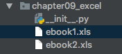
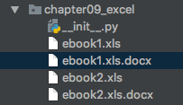
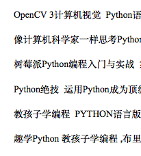

# 0x00 前言

前些天有人给了我两个书单列表，都是excel样式的，每个excel中有大概三千个书名的样子。如果让我找我需要的相关书籍，这是一个不小的工作量。既然才学过Python，就萌生了使用Python提取自己感兴趣的书籍的想法。

# 0x01 第三方模块引入 

在Python中

```python
# 针对 07版excel（xlsx结尾的）,我们可以使用openpyxl来操作读写excel
# 针对 03版excel（xls结尾的），我们可以使用xlrd读，xlwt包来写
# 针对 doc文档，我们可以使用docx操作
```

知道需要哪些模块了，接下来就是安装所需模块。

网上很多都是先下载包，解压后本地执行`python setup.py install`。这显得很麻烦，我直接使用pip命令进行安装了。终端执行`pip install xlrd`，同样使用该方式安装其他所需库即可。

> 无须下载，简单快捷。

# 0x02 开始编程

## 创建项目并把excel拷贝到项目根目录



## 导入刚才安装的模块

```python
import xlrd
import threading
import docx
```

`threading`是Python自带的线程模块

## 读取excel

```python
def read_xls(path, find='', row=-1, col=-1):
    """接收xls文件并读取指定内容返回
    *path* 接收xls路径
    *find* 要查找的内容，为列表格式
    *row* 行数，-1说明没有指定，查找所有行
    *col* 列数，-1说明没有指定，查找所有列
    """
    xls = xlrd.open_workbook(path)
    names = xls.sheet_names()
    print(names)
    sheet = xls.sheet_by_name(names[0])
    row = int(row)
    col = int(col)
    python_books = []
    for i in range(0, sheet.nrows):
        if -1 != row:  # 指定行
            if -1 != col:  # 指定列
                if row == i:
                    for j in sheet.ncols:
                        if j == col:
                            text = sheet.cell_value(i, j)
            else:  # 没指定列
                if row == i:
                    text = sheet.row_values(i)
        else:  # 没指定行
            if -1 != col:  # 指定列
                text = sheet.cell_value(i, col)
            else:  # 没指定列
                text = sheet.cell_value(i, 4)
        if find != "":
            for content in find:
                if content in text:
                    print(text + '\n')
                    python_books.append(text)

        else:
            print(text + '\n')
    return python_books
```

虽然只是个简单的数据提取，但是为了提高程序灵活性，文件路径、行列及搜索值仍然通过传参方式。

`read_xls`实现了读取excel中指定的相关内容到列表，下面要实现存储内容到doc文档。

## 保存内容到doc文档

```python
def save_doc(name, contents, create_new=False):
    """
    *param name* doc文档名称
    *param contents* 文档内容，为列表格式
    *return*
    """
    if create_new:
        doc = docx.Document()
    else:
        doc = docx.Document(name)
    for pb in contents:
        doc.add_paragraph(pb)
    if create_new:
        doc.save(name + '.docx')
    else:
        doc.save(name)
```

该方法实现的是，如果create_new为true则直接创建一个doc文档存储内容，并将文档命名为name。如果为false则直接打开一个名称为name的文档进行存储。

因为这些都是IO操作，应该在工作线程执行。但是这是两个独立的方法，所以还需进行一次包装。

## 2个方法封装

```python
def wrapper(path, find, row, col):
    """包装类，封装读取xls文件方法和保存到doc文档方法
    *param path*
    *param find*
    *param row*
    *param col*
    *return*
    """
    python_books = read_xls(path, find, row, col)
    save_doc(name=path, contents=python_books, create_new=True)
```


## 开启2个工作线程读取并存储内容

```python
find = ['python', 'PYTHON', 'Python']
thread1 = threading.Thread(target=wrapper,
                           kwargs={'find': find, 'path': 'ebook1.xls', 'col': '4', 'row': '-1'})
thread1.start()

thread2 = threading.Thread(target=wrapper,
                           kwargs={'find': find, 'path': 'ebook2.xls', 'col': '4', 'row': '-1'})
thread2.start()
```

## 查看结果

执行后会在项目根目录生成2个对应的doc文档：



打开doc文档看看具体内容吧：



