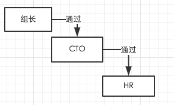
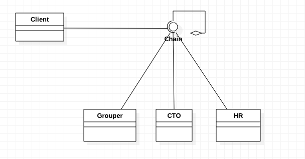

# 说在前面的话

责任链模式也叫职责链，抛开设计模式不谈，单看“责任链”这三个字，关注点一下子就放到了“链”字上了。链即锁链、链条，像链子一样环环相扣的东西。比如我们数据结构中的链表，当前对象持有下一个对象的地址。同样，设计模式中的责任链也是如此，任务一环套一环，环环相扣。

<!-- more -->

# 面试流程分析

作为技术人员离职再就业少不了要面试的，那么我们就拿面试流程来细说。假设面试流程分为三步：组长面试，CTO面试，HR终面，一共三面。

## 不考虑其他任何方面的优化，一个人的面试如何实现？

```
	//面试类
	static class Viewer {
		public void interview(int level) {

			if (0 == level) {// 组长面试
				// TODO
			} else if (1 == level) {// CTO面试
				// TODO
			} else if (2 == level) {// HR终面
				// TODO
			}
		}
	}
```

```
	//客户端
	public static void main(String[] args) {

		Viewer viewer = new Viewer();
		viewer.interview(0);
		viewer.interview(1);
		viewer.interview(2);

	}
```

从上面实现方式可以看出，面试方法，如果要面试三次，那么客户端要调用三次，面试方法interview中对level判断，不同级别有不同人面试，如果以后增加四面，那么就要修改interview方法。

另外每次的面试 `viewer.interview` 都在客户端调用，但是按照正常流程组长面试完，如果觉得可以，应该流程传递到CTO哪里了，CTO谈完了觉得技术良好，最后交给HR谈待遇，流程抽象提取后是这样：




这不就是开头说的“链”吗？

## 下面看看用链如何实现面试的：


先定义一个链接口来控制面试流程：

```
public interface Chain {

	/**
	 * 面试方法
	 * 
	 * @param level
	 */
	void interview();

	/**
	 * 是否通过
	 * 
	 * @return
	 */
	boolean isCross();

	/**
	 * 下一个面试官
	 * 
	 * @param chain
	 */
	void next(Chain chain);
}
```

然后定义组长Grouper、CTO、HR三个面试官类实现Chain接口。

```
	static class Grouper implements Chain {
		private Chain next = null;

		@Override
		public void interview() {
			// TODO Auto-generated method stub

			if (isCross() && next != null) {
				System.out.println("组长面试通过");
				next.interview();
			}
		}

		@Override
		public boolean isCross() {
			// TODO Auto-generated method stub
			return true;
		}

		@Override
		public void next(Chain chain) {
			// TODO Auto-generated method stub
			this.next = chain;
		}

	}

	static class CTO implements Chain {
		private Chain next = null;

		@Override
		public void interview() {
			// TODO Auto-generated method stub
			if (isCross() && next != null) {
				System.out.println("CTO面试通过");
				next.interview();
			}
		}

		@Override
		public boolean isCross() {
			// TODO Auto-generated method stub
			return true;
		}

		@Override
		public void next(Chain chain) {
			// TODO Auto-generated method stub
			this.next = chain;
		}

	}

	static class HR implements Chain {
		private Chain next = null;

		@Override
		public void interview() {
			// TODO Auto-generated method stub
			System.out.println("HR面试通过");
			if (isCross() && next != null) {
				next.interview();
			}
		}

		@Override
		public boolean isCross() {
			// TODO Auto-generated method stub
			return true;
		}

		@Override
		public void next(Chain chain) {
			// TODO Auto-generated method stub

		}

	}
```

然后看看客户端调用：

```
	public static void main(String[] args) {
		Grouper grouper = new Grouper();
		CTO cto = new CTO();
		HR hr = new HR();
		grouper.next(cto);
		cto.next(hr);
		grouper.interview();
	}
```

通过` grouper.next(cto);`和`cto.next(hr);` 设置完链式关系，最后只要通过`grouper.interview();` 调用一次面试就可以了。因为grouper最为链首，其中存储了下一个链元素next。只要条件达成（本次面试通过），则自动执行下一个任务，这就是任务链的好处。

可能还有一个疑问：`grouper.next(cto);` 等流程还是在客户端设置的，这无疑要增加了客户端对底层这些类的认知度。

其实完全可以把这些细节隐藏在底层的。比如我们把流程在Grouper构造方法中设置：

```
		public Grouper() {
			CTO cto = new CTO();
			HR hr = new HR();
			next(cto);
			cto.next(hr);
		}
```

这时客户端是如此的简洁：

```
	public static void main(String[] args) {
		Grouper grouper = new Grouper();
		grouper.interview();
	}
```

其实上面的一般方法还有其他的实现方法，但是无疑常见的实现要么耦合性较强，要么需要客户端对底层认知度高。

说了半天，现在来步入主题看看到底什么是责任链


# 责任链模式

- 模式出现意图

  让多个对象都有机会处理请求，从而避免请求的发送者和接收者之间的耦合关系。将这些对象串成一条链，并沿着链传递请求，直到有一个对象处理它或者处理完毕为止。


- 责任链uml图



